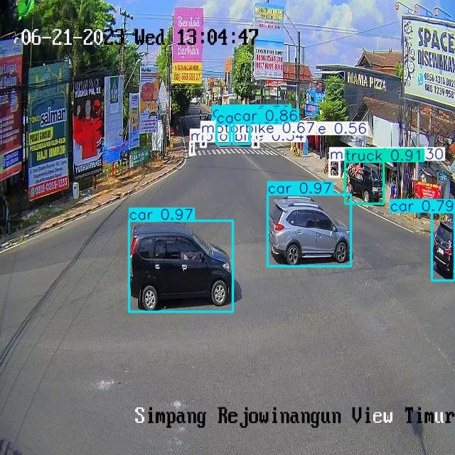
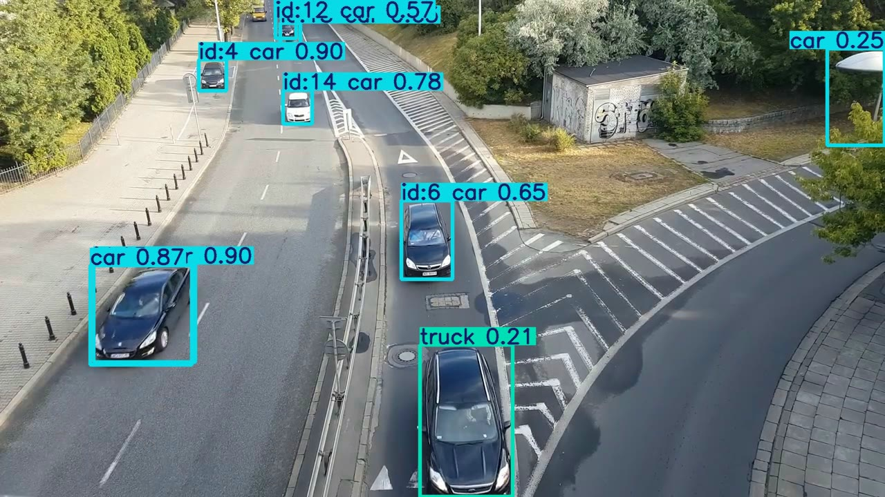
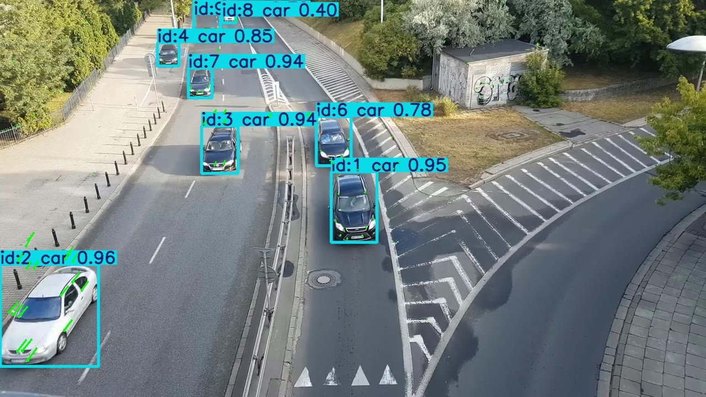

# Real-Time Vehicle Detection and Tracking System

Fine-tuned YOLOv8n on a custom vehicle detection dataset to build a real-time 
perception pipeline for autonomous vehicle applications. Vehicles are detected, 
classified across 4 classes, and tracked with persistent IDs across frames using 
ByteTrack.

---

## Tech Stack
- YOLOv8n (Ultralytics)
- ByteTrack multi-object tracking
- OpenCV for optical flow
- PyTorch
- Dataset sourced from Roboflow

---

## Dataset
- 1,000 images across train/validation/test splits
- 4 classes: bus, car, motorbike, truck
- Source: Roboflow Universe (CC BY 4.0)

---

## Detection Results

Fine-tuned for 50 epochs on a T4 GPU. Inference speed of 7ms per frame 
(approximately 142 FPS), suitable for real-time deployment.

| Class | mAP@0.5 |
|---|---|
| **All** | **88.9%** |
| Bus | 81.5% |
| Car | 94.6% |
| Motorbike | 82.7% |
| Truck | 96.9% |

Motorbike scored lowest due to its smaller pixel footprint compared to cars 
and trucks, a known challenge in small object detection. Despite having the 
most training instances, size was the dominant factor making accurate detection 
harder.

---

## Tracking

ByteTrack tracking implemented on top of the fine-tuned detector, assigning 
persistent IDs to vehicles across frames at 7ms per frame inference speed.

---

## Optical Flow

Lucas-Kanade sparse optical flow implemented using OpenCV to measure pixel-level 
motion vectors across frames, complementary to tracking for vehicle state estimation.

---

## Connection to PTISS Patent

This perception pipeline directly supports the vehicle state estimation component 
of my patent-pending PTISS (Predictive Traffic Instability Suppression System). 
A deployed PTISS system would use ByteTrack-style tracking to assign persistent 
IDs to vehicles and compute per-vehicle speed and headway across frames. Optical 
flow serves as a complementary signal, measuring aggregate pixel motion to detect 
traffic flow changes before individual vehicles are identified. Together these feed 
real-world vehicle state estimates into the PTISS LSTM model, which predicts 
instability before it propagates, enabling proactive speed harmonization rather 
than reactive control.

---

## What I Learned
mAP (mean Average Precision) is a metric that measures a model's accuracy in 
both classifying and localizing objects across multiple classes, combining 
precision and recall into a single number per class then averaging across all 
classes. The motorbike scored lowest despite having the most training instances 
because size was the dominant factor. Motorbikes occupy far fewer pixels making 
them harder to detect accurately. I learned that optical flow measures pixel-level 
motion without knowing what objects are, while YOLOv8 detects and classifies 
specific objects, two complementary approaches to understanding vehicle movement 
in traffic scenes. I also learned how to properly utilize cloud GPU infrastructure 
through Google Colab T4 to train and evaluate computer vision models efficiently.

---

## What I'd Improve
To improve motorbike detection accuracy I would collect more training data 
specifically featuring motorbikes at varying sizes and distances, and experiment 
with anchor sizes tuned for small object detection. With more compute I would 
train a larger model such as YOLOv8m or YOLOv8l for more epochs to push overall 
mAP higher across all classes.
